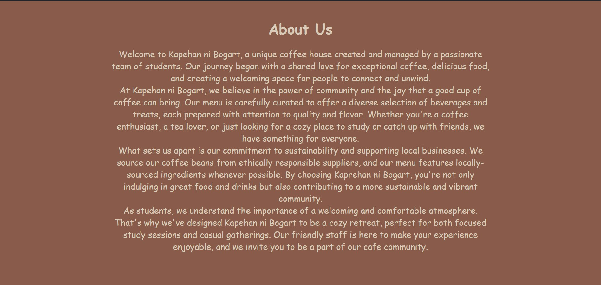

# Project Description

 Welcome to Kapehan ni Bogart, a unique coffee house created and managed by a passionate team of students. Our journey began with a shared love for exceptional coffee, delicious food, and creating a welcoming space for people to connect and unwind.

 At Kapehan ni Bogart, we believe in the power of community and the joy that a good cup of coffee can bring. Our menu is carefully curated to offer a diverse selection of beverages and treats, each prepared with attention to quality and flavor. Whether you're a coffee enthusiast, a tea lover, or just looking for a cozy place to study or catch up with friends, we have something for everyone.

 What sets us apart is our commitment to sustainability and supporting local businesses. We source our coffee beans from ethically responsible suppliers, and our menu features locally-sourced ingredients whenever possible. By choosing Kaprehan ni Bogart, you're not only indulging in great food and drinks but also contributing to a more sustainable and vibrant community.

 As students, we understand the importance of a welcoming and comfortable atmosphere. That's why we've designed Kapehan ni Bogart to be a cozy retreat, perfect for both focused study sessions and casual gatherings. Our friendly staff is here to make your experience enjoyable, and we invite you to be a part of our cafe community.

 ## Features
* Menu
* Home
* About
* Contact

## Screen Captures

Welcome to "Kapehan ni Bogart",  a charming and cozy café nestled in the heart of the bustling city. As you step through the door, you are greeted by the inviting aroma of freshly brewed coffee and the subtle notes of exotic teas that permeate the air. The warm, earthy tones of the decor create a soothing ambiance, making it the perfect retreat for those seeking a moment of tranquility amidst the urban chaos.

## About the Authors

Remark Timonez - Founder and Culinary Curator:
A visionary in the world of culinary arts, Olivia brings her passion for flavors and aesthetics to Kapehan ni Bogart. With a background in culinary design, she crafts the café's delightful menu, ensuring every dish tells a story of quality and creativity. Remark's commitment to a sensory journey is evident in every bite, making Sereni-tea Haven a haven for gastronomic bliss.

Drexzel Paul Lambon - Co-founder and Design Maestro:
The artistic force behind Sereni-tea Haven's inviting ambiance, Drexzel infuses the space with warmth and character. With a keen eye for design, he transforms the café into a tranquil retreat, creating an atmosphere that invites patrons to linger and savor the moment. Drexzels's dedication to aesthetic detail ensures that every visit to Kapehan ni Bogart is a visual and tactile delight.

## Contact Us

Feel free to contact us for deliveries and reservation. You are always welcome to Kapehan ni Bogart.

 **Name:** Drexzel Paul Lambon

 **Email:** 202180275@psu.palawan.edu.ph

 **Name:** Remark Timones

 **Email:** 202180037@psu.palawan.edu.ph

For more details, visit the [Contact Section](#contact-us)

--- 

***&copy; 2023 Kapehan ni Bogart. All Rights Reserved.**

Connect with us on our social media:

**Remark Timones**

**Drexzel Paul Lambon**

